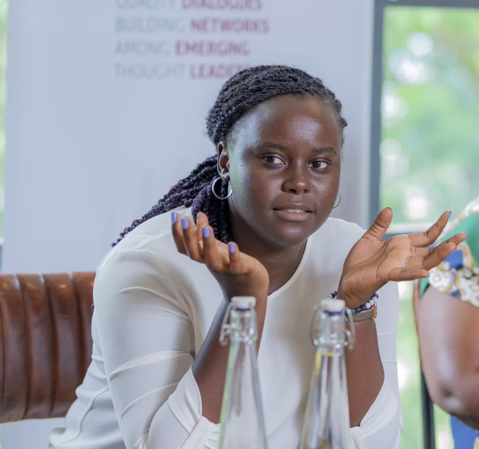

# Case Study: Inclusive Spaces for Women with Owilla Abiro Mercy

  

  <em>Owilla Abiro Mercy</em>

Owilla Abiro Mercy, a non-profit sector worker and co-founder of a gender tech initiative, addresses the lack of women-centric narratives in media and tech spaces in Uganda. Facing male dominance in these areas, she co-founded an organization to empower girls in both rural and urban settings.

The organization encountered challenges such as resistance from men in the field and patriarchal backlash. They struggled to gain an audience, with men in the same space discouraging them from leading the organization. Despite facing setbacks, including a man vying for the executive director role, they remained committed to their principles.

"They are creating inclusive spaces, but that's not the point. For Owilla Abiro Mercy, inclusivity only comes with active participation. Because including can also mean 'I'm inviting you to the table, but it doesn't mean you have a chance to speak out your mind and engage in the conversation.'"

The organization shifted its approach from a business-oriented model to community-focused, rejecting individuals motivated solely by personal benefits. Since its inception, the organization has trained over a thousand girls and young women, steadily building and adapting their tech hub programs for diverse contexts. Mercy emphasizes the importance of active participation, breaking barriers, and designing programs that address the unique challenges faced by women in various societal contexts.

The presentation of Owilla Abiro Mercys work was followed by a Questions and Answers session with the participants of the webinar.  

Find the video with Owilla Abiro Mercy [here](https://www.youtube.com/watch?v=vHWmjZjdiVs) (start: 10:55 min.).

## Exercise 
Therefore participants need pen and paper.

* Before we started I did not know _____ .(1 minute)
* Now I have learnt _____ . (1 minute)
* Complete the Inequality Triangle [S.A.M.A] (4 minutes)

Offline, with team, discuss, type, email or submit for discussion at next meeting which will be on……..(lets decide now)
