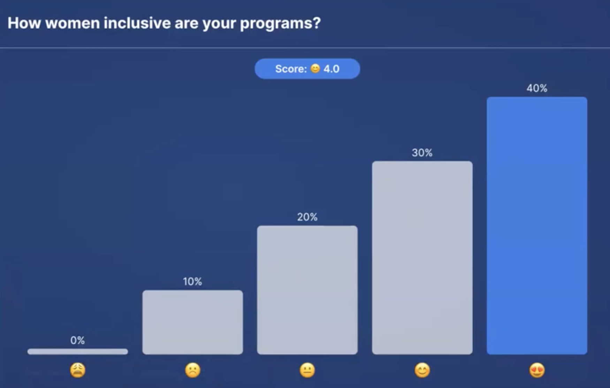

# Title of the Resource / Guide / etc.

## Objectives
* Teach #ASKnet community new skills which help enable women empowerment and support  to build networks in their communities.
* Provide participants with concrete strategies and tools for creating inclusive spaces for women
* Discuss best practices for maintaining women's participation in media activities and workshops.
* Develop practical skills and tools for implementing these best practices in their own organizations and work. 
* Offer strategies for addressing the challenges faced by the women and organizations themselves

## Co-Creation of Key Questions for Empowering Women and Building Inclusive Spaces

During this session, a collaborative process will be employed to generate three key questions: 'What,' 'Why,' and 'How.' The session will delve into the 'what,' focusing on the core content or subject matter. It will address the 'why' to emphasize the significance and relevance of this content. Most importantly, the primary focus will be on sharing the 'how,' offering concrete strategies and actionable steps to empower and support women within their communities and facilitate the creation of inclusive spaces.

### The What?

#### What comes to mind first when you think about this topic and your work? 
**Answers from the webinar participants:**
* What do I think of first? Great stories, great experiences that want and need to be shared.
* It´s giving everyone sitting on the table and letting their voices be heared 
* Creating room for equity.
* Share stories and experiences. 
* It´s all about inclusivity and making sure the obstacles that may be in the way of woman in tech and media are removed. 
* What comes to mind is not just including women, but making sure that they are actually empowered and bringing results to the tabel.

### The Why?

#### Why does women inclusion in tech and media spaces matters?

  

  <em>Answers from the participant in form of a tag cloud</em>

#### How women inclusive are the programs of the participants of the webinar?

  

  <em>Answers from the participant in form of a diagram</em>

### The How?

#### What can / should we be doing? 

#### What resources / tools do we need? 

## Inequality Triangle 

_"The greates poverty that anyone can ever have is lack of access."_  
by the unknown cousin 

Inclusion inherently entails providing access and opportunities. In various programs and projects, the aspiration is always to maximize inclusion. However, the absence of the necessary expertise can often lead to challenges. This is where the Gender Inequality Triangle tool comes into play, offering a solution to bridge the gap and enhance inclusivity.

  

  <em>The Inequality Triangle</em>

It consist of three sites and has four simple steps that one can take.

**1. Scan:**  
   Scan the room to ensure representativeness. Look around to check if we are all here (this creates self-awareness).  
   "Is everyone here? Are we all represented?"  
   "Do we have women from minority / ethnicity groups? Are they represented?"

**2. Awarenss:**  
   1.  Create corporate awareness (the fact that you know that not everyone is represented does not mean that the next person is aware). You do this by asking the next person if we are all represented.  
   "Neighbour are you aware that not everyone is represented? There are people who are missing." 

   2. Come up with solutions to address gender inequality.  
   "Ask your employee to reach out to people who aren`t part of the program / course / etc. yet." 
     
**3. Solutioning:**   
   Actioning - actually putting the solutions into actions.  
    “Finding a hundred solutions and implementing none is an exercise in futility” (Warren Buffett)  
    
Reference: [Gender inequality starts in the home | Matshepo Msibi | TEDxLytteltonWomen](https://www.youtube.com/watch?v=yqF5C0xU-f4)

Homework: Think about your work / projects / courses / etc.

The recording of the first webinar session can be found [here](https://www.youtube.com/watch?v=yaRG2TEdWhY)

## Case Study with Owilla Abiro Mercy

Owilla Abiro Mercy is manly working in non profit sector, she is: 
* Creating inclusives spaces for women and girls
* working with journalists at the African Institute for investigativ Journalism
* Co-founder of gender tech initiative 

A lot of tech and media spaces she has experinced were run by men, this fact drove her into a space for "How do we have women telling women stories."
One of the challenges she experienced was: when media or news are reporting about women, they don´t understand what women are actually facing. From her point of view the media landscape in Uganda has been dominated by men, so the narratives they put across about women are totally from a male perspective and not from the female who goes through it. Which was a huge gap for her. She also realized in schools in terms of inclusivity, girls take a backseat when it comes to tech, science etc. STEM-fields. 
She also experienced that this gap is even bigger between women in rural and urban settings, thats why she cofounded an organization that supports and empowers girls to claim this classic men driven spaces.  
When thy set up the space at first, they didn´t had an idea what to do, so they started to collect and share ideas. On major issue they faced in the beginning was, that the weren`t given an audience. They wanted to start this orgnaization as womens, but they were hold back by mens in the same space who were telling them, "no you can´t do that, give me your organization, I´m a man, let me run it for you and you take the backseat. So the challenge was being able to speak out to men, because in Uganda this kind of spaces for women and girls were usually run by men. The men didn´t let the express their selfs and run their acitivties in a way they would want them to be run. Because of the patriarchal society they faced a lot of backlash. especially in the rural area where they have been. 
Most of the girls in that area dont go past primary seven, when they reach highschool they get married off. 
So there topics were:
* How do we best make these programs accessible for all?
* How do we make the community to look at us coequal?
* They also had to figure out how to include the men.

They learned that most of the women and girl had to ask their father / husband for permission to attend this trainings, so they started to go into the community. They shared their ideas and programms with them and told them, "We are not your enemies here to empore your women and girls."
They came to the conclusion, if they want to continue with their programm in that area, with this community they have to seek aproval by the men.
Regardless of wether the community is respetive, they still have to figure out how to tailor their program / structure in a way that dosent make them look like enemies within the community.
They wanted to create this safe space for young women and girls to come togehter and it was against their attitude to let this space run by a men, only to get things done more easily. This wasnt compatible with what they stood for. 
One time they were looking for board members and they interviewed a guy who told them: "Here is the thing, I dont want to be on your board, whoever I want to be the executive director of your organization and I need you to sign off your powers of attorney." Even that guy had a lot of muscles in the space they declined to work with him, which was a major setback. 
They experience that many people whant to join the organization only because of financal reasons and personal benifits. 
So they came to the conclusion they have to run their organization for the community instead of as a business.  
Since they started they trained over a thousand girls and young women and also since then they keep on building their organization steadily.  

## Exercise 
Therefore participants need a pen and paper. 

