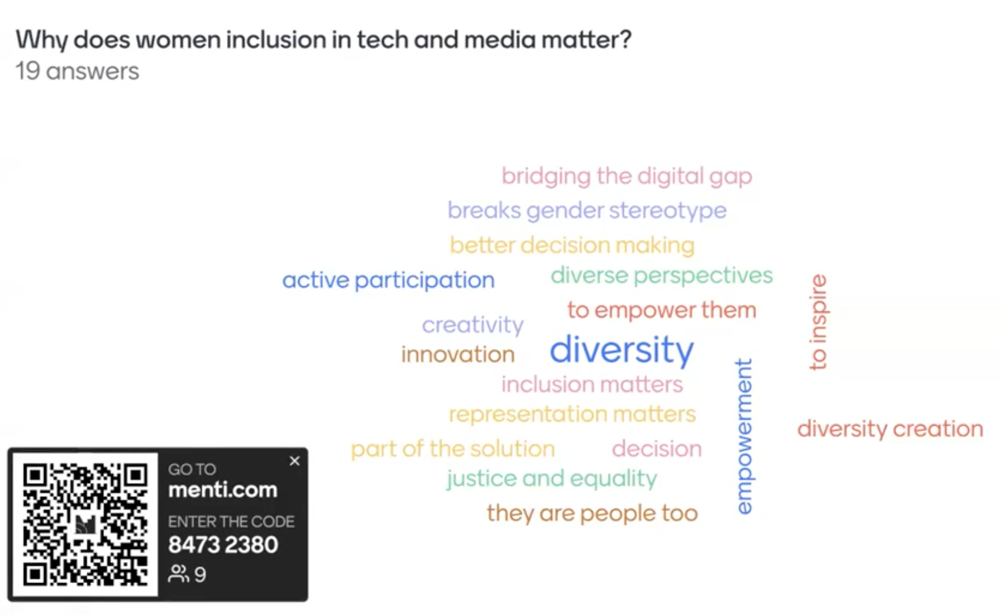

# Title of the Resource / Guide / etc.

## Objectives
* Teach #ASKnet community new skills which help enable women empowerment and support  to build networks in their communities.
* Provide participants with concrete strategies and tools for creating inclusive spaces for women
* Discuss best practices for maintaining women's participation in media activities and workshops
Develop practical skills and tools for implementing these best practices in their own organizations and work
Offer strategies for addressing the challenges faced by the women and organizations themselves

## Co-creation of the three Questions What, Why and How:
the session is going for to co-create, we will treat the what, the why it matters and the more importantly we want to share the how

### The What?

#### What comes to mind first when you think about this topic and your work? 
* What do I think of first? Great stories, great experiences that want and need to be shared
* it´s giving everyone sitting on the table and letting their voices be heared 
* creating room for equity 
* share stories and experiences 
* it´s all about inclusivity and making sure the obstacles that may be in the way of woman in tech and media are removed 
* what comes to mind is not just including women, but making sure that they are actually empowered and bringing results to the tabel

### The Why?

#### Why does women inclusion in tech and media spaces matters?

  

  <em>Answers from the participant in form of a tag cloud</em>

#### How women inclusive are the programs of the participants of the webinar?

  

  <em>Answers from the participant in form of a diagram</em>

### The How?

#### What can/should we be doing? 

#### What resources/tools do we need? 
