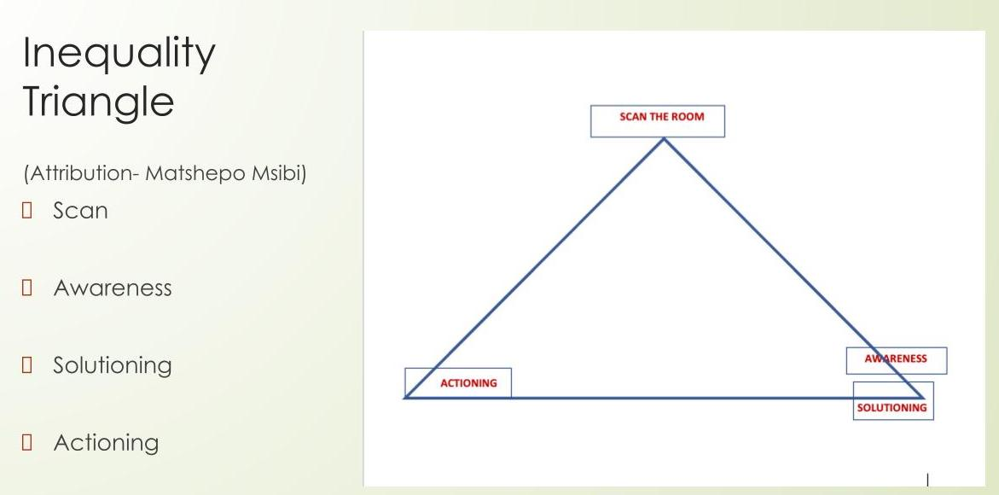

# Title of the Resource / Guide / etc.

## Objectives
* Teach #ASKnet community new skills which help enable women empowerment and support  to build networks in their communities.
* Provide participants with concrete strategies and tools for creating inclusive spaces for women
* Discuss best practices for maintaining women's participation in media activities and workshops.
* Develop practical skills and tools for implementing these best practices in their own organizations and work. 
* Offer strategies for addressing the challenges faced by the women and organizations themselves

## Co-Creation of Key Questions for Empowering Women and Building Inclusive Spaces

During this session, a collaborative process will be employed to generate three key questions: 'What,' 'Why,' and 'How.' The session will delve into the 'what,' focusing on the core content or subject matter. It will address the 'why' to emphasize the significance and relevance of this content. Most importantly, the primary focus will be on sharing the 'how,' offering concrete strategies and actionable steps to empower and support women within their communities and facilitate the creation of inclusive spaces.

### The What?

#### What comes to mind first when you think about this topic and your work? 
**Answers from the webinar participants:**
* What do I think of first? Great stories, great experiences that want and need to be shared.
* It´s giving everyone sitting on the table and letting their voices be heared 
* Creating room for equity.
* Share stories and experiences. 
* It´s all about inclusivity and making sure the obstacles that may be in the way of woman in tech and media are removed. 
* What comes to mind is not just including women, but making sure that they are actually empowered and bringing results to the tabel.

### The Why?

#### Why does women inclusion in tech and media spaces matters?

  

  <em>Answers from the participant in form of a tag cloud</em>

#### How women inclusive are the programs of the participants of the webinar?

  

  <em>Answers from the participant in form of a diagram</em>

### The How?

#### What can/should we be doing? 

#### What resources/tools do we need? 

## Inequality Triangle 

_"The greates poverty that anyone can ever have is lack of access."_  
by the unknown cousin 

Inclusion inherently entails providing access and opportunities. In various programs and projects, the aspiration is always to maximize inclusion. However, the absence of the necessary expertise can often lead to challenges. This is where the Gender Inequality Triangle tool comes into play, offering a solution to bridge the gap and enhance inclusivity.

  

  <em>The Inequality Triangle</em>

It consist of three sites and has four simple steps that one can take.

**1. Scan:**  
   Scan the the room/ to ensure representativeness. Look around to check if we are all here (this creates self-awareness).  
   "Is everyone here? Are we all represented?"
   "Do we have women from minority / ethnicity groups? Are they represented?"

**2. Awarenss:**  
   1.  Create corporate awareness (the fact that you know that not everyone is represented does not mean that the next person is aware). You do this by asking the next person if we are all represented.  
   "Neighbor are you aware that not everyone is here? There are people who are missing." 

   2. Come up with solutions to address gender inequality.  
   "Ask your employee to reach out to people who aren`t part of the program / course / etc. yet." 
     
**3. Solutioning:**   
   Actioning - actually putting the solutions into actions.
    “Finding a hundred solutions and implementing none is an exercise in futility” (Warren Buffett)  
    
Reference: [Gender inequality starts in the home | Matshepo Msibi | TEDxLytteltonWomen](https://www.youtube.com/watch?v=yqF5C0xU-f4)

Homework: Think about your work / projects / courses / etc.

The recording of the first webinar session can be found [here](https://www.youtube.com/watch?v=yaRG2TEdWhY)